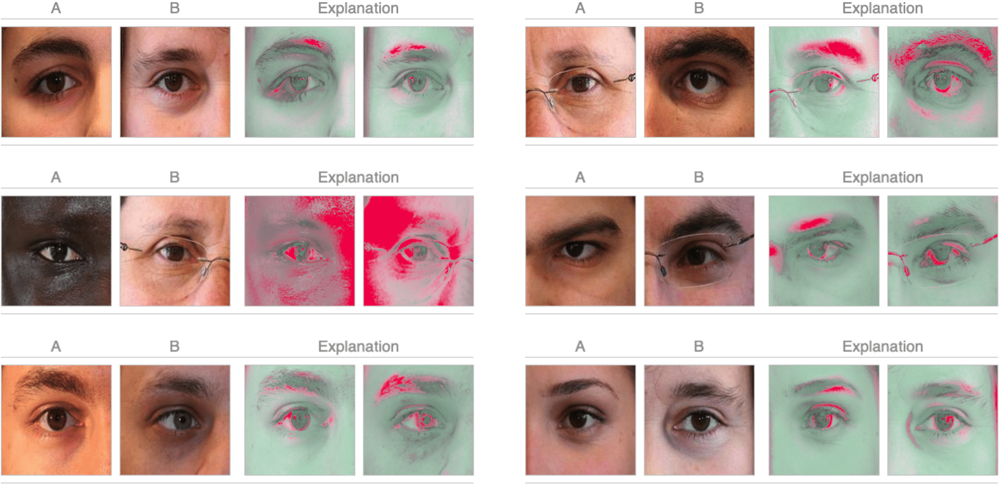

# Interpretable Periocular Recognition
Code for the method proposed in "A Deep Adversarial Framework for Visually Explainable Periocular Recognition", as seen in CVPR 2021 Biometrics Workshop. [[Full Paper]](https://openaccess.thecvf.com/content/CVPR2021W/Biometrics/papers/Brito_A_Deep_Adversarial_Framework_for_Visually_Explainable_Periocular_Recognition_CVPRW_2021_paper.pdf)[[Workshop Slides]](https://drive.google.com/file/d/1yb2cm0lWAVAy2EPBywjPQ4OZSLG0f4Uc/view?usp=sharing)



# Requirements
Please install and verify the presence of the following requirements (as tested):
```python
OpenCV-Python 4.0.1
NumPy 1.19.4
Scikit-image 0.16.2
Pillow 7.2.0
Natsort 7.0.1
PyTorch 1.3.1
Torchvision 0.4.2
Imutils 0.5.3
Matplotlib 3.3.1
CUDA 10.1/10.2
```

# Learning
All trained models and (non-synthetic) datasets are available in [Google Drive](https://drive.google.com/drive/folders/1mRBkWxqC-can6dLeewhnwnnWzvN1FPP8?usp=sharing).

Skip the next steps and jump to the **Inference** section if you **do not** wish to train the models again (if so, simply download the **trained_models** directory and replace the empty one).

## Datasets
Download and unzip **dataset.zip** and **mask_rcnn_training_and_test_dataset.zip**. Then, place the resulting files from the former in the **/dataset** directory and the ones from the latter in the **/learning/train_mask_rcnn** directory.

## DenseNet-161
1) **Data pre-processing**
    
    Run the **run_preprocessing.py** script with the "TRAIN_CNN_DISTINGUISH_PAIRS" variable set to `True`:
    ```
    cd learning/prepare_dataset/
    python3 run_preprocessing.py
    ```

2) **Training**

    Run the **train_cnn.py** script:
    ```
    cd learning/train_densenet_161/
    python3 train_cnn.py
    ```

## ResNet-18
1) **Data pre-processing**
    
    Run the **run_preprocessing.py** script with the "TRAIN_CNN_SIDE" variable set to `True`:
    ```
    cd learning/prepare_dataset/
    python3 run_preprocessing.py
    ```

2) **Training**

    Run the **train_cnn_side.py** script:
    ```
    cd learning/train_resnet_18/
    python3 train_cnn_side.py
    ```

## StyleGAN2
1) **Data pre-processing**
    
    Run the **run_preprocessing.py** script with the "TRAIN_GAN_PAIRS" variable set to `True`:
    ```
    cd learning/prepare_dataset/
    python3 run_preprocessing.py
    ```

2) **Training**

    Run the **prepare_data.py** and **train_gan.py** scripts:
    ```
    cd learning/train_stylegan_2/
    python3 prepare_data.py --out ./outputs/dataset/dataset.lmdb --n_worker 1 --size 256 ../../dataset/data/train/1/
    python3 train_gan.py ./outputs/dataset/dataset.lmdb/ --genuine_or_impostor G
    ```

## Mask R-CNN
1) **Data pre-processing**

    Run the **preprocess_data.py** script:
    ```
    cd learning/train_mask_rcnn/
    python3 preprocess_data.py
    ```

2) **Training**

    Run the **periocular_segmentation.py** script:
    ```
    cd learning/train_mask_rcnn/
    python3 periocular_segmentation.py train --weights coco 
    ```

# Inference
1) **Generating the synthetic dataset**

    Run the **generate_synthetic_dataset.py** script:
    ```
    cd inference/code/stylegan_2
    python3 generate_synthetic_dataset.py
    ```

2) **Segmenting the synthetic dataset**

    Run the **get_segmentation_maps.py** script:
    ```
    cd inference/code/stylegan_2
    python3 get_segmentation_maps.py
    ```

3) **Processing the synthetic dataset**

    Run the **process_synthetic_dataset.py** script:
    ```
    cd inference/code/stylegan_2
    python3 process_synthetic_dataset.py
    ```

4) **Recognising and explaining a test pair**

    Run the **explain_pair.py** script (assuming that **2 test images** have been placed inside the **/inference/images** directory):
    ```
    cd inference
    python3 explain_pair.py
    ```
    The scrip above will classify the given pair as being either ***genuine*** or ***impostor*** and also return a visual explanation that, in the case of a *non-match* decision, serves as intrinsic justification.

# Citation
If you are using our code, please consider citing our paper: 

```bibtex
@InProceedings{Brito_2021_CVPR,
    author    = {Brito, Joao and Proenca, Hugo},
    title     = {A Deep Adversarial Framework for Visually Explainable Periocular Recognition},
    booktitle = {Proceedings of the IEEE/CVF Conference on Computer Vision and Pattern Recognition (CVPR) Workshops},
    month     = {June},
    year      = {2021},
    pages     = {1453-1461}
}

