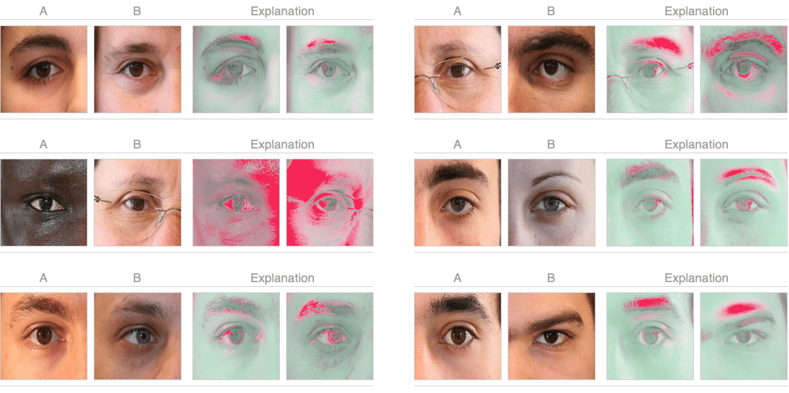

**README**

# ✨ Interpretable Periocular Recognition

This repository contains code that replicates the results and experiments seen in the paper ***"A Deep Adversarial Framework for Visually Explainable Periocular Recognition"***, as presented at CVPR 2021 Biometrics Workshop.

In this study, we propose a **periocular recognition
framework** that integrates biometric recognition with **visual interpretations of the features or regions that contribute the most** to a final *match/non-match* decision.

[[Full Paper]](https://openaccess.thecvf.com/content/CVPR2021W/Biometrics/papers/Brito_A_Deep_Adversarial_Framework_for_Visually_Explainable_Periocular_Recognition_CVPRW_2021_paper.pdf)[[Workshop Slides]](https://drive.google.com/file/d/1_Q-fl4_AV0rjlaTJyPPnMg0uQ9vJI3vk/view?usp=share_link)



# 📋 Installation & setup
This project targets **Python 3.7 and CUDA=10.1/10.2**. If your system complies, you can install *ExplainablePR* as follows:

```python
python3.7 -m venv .venv
source .venv/bin/activate
.venv/bin/python3 -m pip install -r requirements.txt
```

All trained models are available through the following links:

* [StyleGAN2](https://drive.google.com/file/d/1qsCE8AcXetR7FH4Xy-PwJAfEn67DFV24/view?usp=sharing);
* [DenseNet-161](https://drive.google.com/file/d/1I7FZaRgWBsliOzdxmYf7nF6bCnAgvy_S/view?usp=sharing);
* [ResNet-18](https://drive.google.com/file/d/1-zdMW5C3tJFw7t4A2eFvoYaFd-jj2efC/view?usp=sharing);
* [Mask R-CNN](https://drive.google.com/file/d/1Q2UhscOCrI5VOH87N3m6zwwtPx-sT-aG/view?usp=sharing).

Additionally, the UBIPr dataset is available [here](https://drive.google.com/file/d/1gDNiNaSwOPQU1czAT6NYWd1TFurJazHx/view?usp=sharing).

# 🧠 Learning

In this section you'll find detailed instructions for **preparing the data and training** all the required models for this project.

## DenseNet-161
1) **Data pre-processing**
    
    Run the `run_preprocessing.py` script with the `TRAIN_CNN_DISTINGUISH_PAIRS` variable set to `True`:
    ```
    cd learning/prepare_dataset/
    ../../.venv/bin/python3 run_preprocessing.py
    ```

2) **Training**

    Run the ```train_cnn.py``` script:
    ```
    cd learning/train_densenet_161/
    ../../.venv/bin/python3 train_cnn.py
    ```

## ResNet-18
1) **Data pre-processing**
    
    Run the `run_preprocessing.py` script with the `TRAIN_CNN_SIDE` variable set to `True`:
    ```
    cd learning/prepare_dataset/
    ../../.venv/bin/python3 run_preprocessing.py
    ```

2) **Training**

    Run the `train_cnn_side.py` script:
    ```
    cd learning/train_resnet_18/
    ../../.venv/bin/python3 train_cnn_side.py
    ```

## StyleGAN2
1) **Data pre-processing**
    
    Run the `run_preprocessing.py` script with the `TRAIN_GAN_PAIRS` variable set to `True`:
    ```
    cd learning/prepare_dataset/
    ../../.venv/bin/python3 run_preprocessing.py
    ```

2) **Training**

    Run the `prepare_data.py` and `train_gan.py` scripts:
    ```
    # data preparation
    cd learning/train_stylegan_2/
    ../../.venv/bin/python3 prepare_data.py --out ./outputs/dataset/dataset.lmdb --n_worker 1 --size 256 ../../dataset/data/train/1/
    
    # training
    ../../.venv/bin/python3 train_gan.py ./outputs/dataset/dataset.lmdb/ --genuine_or_impostor G
    ```

## Mask R-CNN
1) **Data pre-processing**

    Run the `preprocess_data.py` script:
    ```
    cd learning/train_mask_rcnn/
    ../../.venv/bin/python3 preprocess_data.py
    ```

2) **Training**

    Run the `periocular_segmentation.py` script:
    ```
    cd learning/train_mask_rcnn/
    ../../.venv/bin/python3 periocular_segmentation.py train --weights coco 
    ```

# 🚀 Inference
1) **Generating the synthetic dataset**

    Run the `generate_synthetic_dataset.py` script:
    ```
    cd inference/code/stylegan2
    ../../../.venv/bin/python3 generate_synthetic_dataset.py
    ```

2) **Segmenting the synthetic dataset**

    Run the `get_segmentation_maps.py` script:
    ```
    cd inference/code/stylegan2
    ../../../.venv/bin/python3 get_segmentation_maps.py
    ```

3) **Processing the synthetic dataset**

    Run the `process_synthetic_dataset.py` script:
    ```
    cd inference/code/stylegan2
    ../../../.venv/bin/python3 process_synthetic_dataset.py
    ```

4) **Recognising and explaining a test pair**

    Run the `explain_pair.py` script (assuming that `2 test images` have been placed inside the `/inference/images` directory):
    ```
    cd inference
    ../.venv/bin/python3 explain_pair.py
    ```
    The scrip above will classify the given pair as being either ***genuine*** or ***impostor*** and also return a visual explanation that, in the case of a *non-match* decision, serves as intrinsic justification.

# 📖 Citation
If you find our code useful, please consider citing our paper: 

```bibtex
@InProceedings{Brito_2021_CVPR,
    author    = {Brito, Joao and Proenca, Hugo},
    title     = {A Deep Adversarial Framework for Visually Explainable Periocular Recognition},
    booktitle = {Proceedings of the IEEE/CVF Conference on Computer Vision and Pattern Recognition (CVPR) Workshops},
    month     = {June},
    year      = {2021},
    pages     = {1453-1461}
}
```
